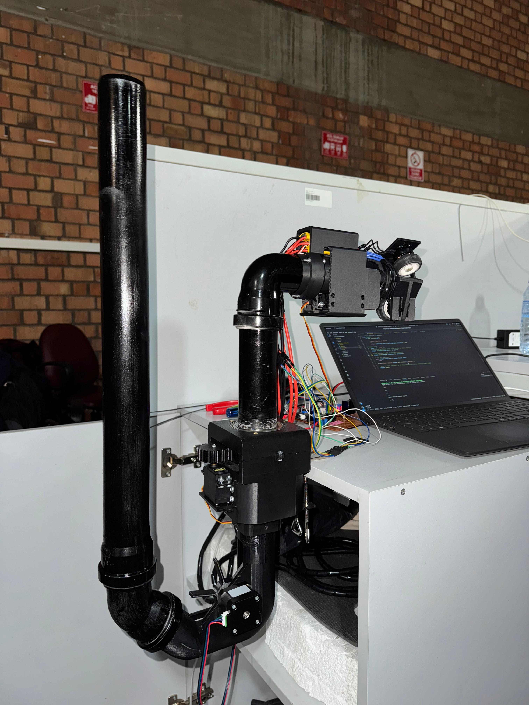

# KingPong

Automatic table-tennis ball pitcher machine, developed as the main assignment of ME407 – Mechanical Engineering Design at Middle East Technical University. Designed to let a single player practice with realistic spin, speed and trajectory control.

## Media

### Team Demo at METU Showcase  
  
*The ME407 design group presenting their automatic table-tennis ball pitcher, KingPong, at the METU Mechanical Engineering Department exhibit.*

### METU Mechanical Engineering LinkedIn 

### Pitching Mechanism Close-Up  
  
*Detailed view of the dual-wheel launcher assembly with servo-driven feeder, control wiring, and live parameter tuning via the host laptop.*

### Mode Shape 3: Modal Analysis Result

*Figure: Mode shape 3 from the modal analysis of the spinning‐wheel assembly, illustrating the natural vibration pattern at its associated eigenfrequency.*

## Repository Structure

- **hardware/**  
  CAD models, mechanical drawings and BOM for the launcher, feeder and frame  
- **software/**  
  • `firmware/` Arduino code for motor, servo and sensor control  
  • `host/` Python scripts for remote parameter tuning and logging  
- **reports/**  
  Final report (FR_C1.pdf) and supporting calculations, test plans and sustainability analysis  
- **workshops/**  
  Presentation slides and in-class exercise materials  
- `.gitignore` Standard excludes for build artifacts  
- `.gitattributes` Line endings and diff settings  
- `LICENSE` MIT License  

## Key Features

- **Speed & Frequency** Adjustable launch speed up to 30 m/s and firing rate up to 60 balls/min  
- **Spin Control** Topspin, backspin, sidespin, or any combination of spins (and a no-spin “flat” option) via independent wheel speeds  
- **Trajectory** Pitch range 0 → –20°; yaw range ± 20°  
- **Capacity & Recycling** Reservoir holds ≥ 60 balls; returned balls are automatically fed back  
- **Size & Weight** Fits within 1 m³; total mass ≤ 25 kg  
- **Power** Runs on standard 220–240 V mains; < 2 kW peak consumption  

## Getting Started

1. **Assemble hardware** following the step-by-step CAD drawings in `hardware/`.  
2. **Flash firmware**: open `software/firmware/` in the Arduino IDE and upload to your controller board.  
3. **Launch host interface**: run `python3 software/host/control.py` to connect via USB or Wi-Fi and set speed, spin, pitch and yaw.  
4. **Consult report** in `reports/FR_C1.pdf` for detailed design rationale, calculations and test results.  

## Authors

- Abdullah Can Seyhanlı  
- Altay Ata Ateş  
- Arman Utku Aydın  
- Bilal Açıksöz  
- Kutay Can Yapıcı  
- Ömer Aslan  
- Özge Dilan Tuna
- Abdullah Salih Taşdelen  
- Yunus Emre Özçelik  

## License

This project is released under the MIT License.  
